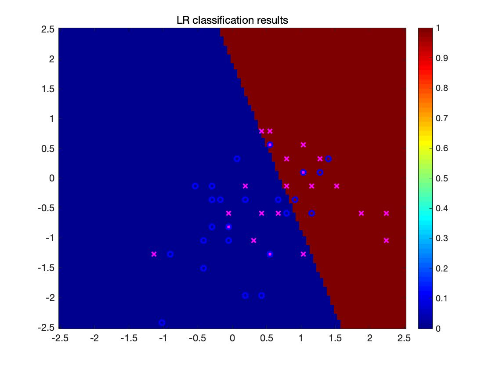

# Assignment 5

## 1

- K = 2, cluster quality is 83.5.
- K = 3, cluster quality is 62.8.
- K = 4, cluster quality is 57.9.
- K = 5, cluster quality is 54.9.

As the K increase, the cluster quality decrease. When K equals to 2, the cluster gets its best quality which is 83.5.

## 2

seed | K | cluster quality
---- | - | ---------------
0    | 3 | 64.1
1    | 3 | 62.8
2    | 3 | 73.8
3    | 3 | 65.4
4    | 3 | 75.6
5    | 3 | 83.5
6    | 3 | 65.6
7    | 3 | 62.7

## 3

Clustering accuracy improved after uncommenting

```matlab
X = meas; d = 4;
```

The **meas** has 150 rows and 4 columns.

Before uncommenting the code above.

```matlab
X = meas(:,1:2); d = 2;
```

The **X** takes the first two columns of **meas**.

Why???????????

## 4

## 4-3

1. Run Cell2A. Naïve Bayes classifiers

  - NB Train acc: 0.70
  - NB Test acc: 0.74 

2. Run Cell2B. LR classifiers

  - LR Train acc: 0.70
  - LR Test acc: 0.76 

## 4-4

Decision is the LR classifiers , that the test accuracy is 0.76 which is better than Naïve Bayes classifiers Test accuracy.

## 4-5

1. threshold = 0.3

  - LR Train acc: 0.64
  - LR Test acc: 0.60
  - 
  - NB Train acc: 0.64
  - NB Test acc: 0.62
  - 

2. threshold = 0.6

  - LR Train acc: 0.68
  - LR Test acc: 0.72
  - 
  - NB Train acc: 0.68
  - NB Test acc: 0.72
  - 

3. threshold = 1.0

  - LR Train acc: 0.52
  - LR Test acc: 0.54
  - 
  - NB Train acc: 0.50
  - NB Test acc: 0.56
  - 

## 4-6

```matlab

count = 1;
for i = 0:0.05:1
    thr = i;
    predTr = pTrLR>thr; fprintf(1,'LR Train acc: %1.2f\n', sum(Ytr==predTr)/numel(Ytr));
    predTe = pTeLR>thr; fprintf(1,'LR Test acc: %1.2f\n',  sum(Yte==predTe)/numel(Yte));
    cmat = confusionmat(Yte,double(predTe))
    tpr_lr(count)=cmat(2,2)/sum(Yte==1);
    fpr_lr(count)=cmat(1,2)/sum(Yte==0);

    predTr = pTrNB(:,2)>thr; fprintf(1,'NB Train acc: %1.2f\n', sum(Ytr==predTr)/numel(Ytr));
    predTe = pTeNB(:,2)>thr; fprintf(1,'NB Test  acc: %1.2f\n', sum(Yte==predTe)/numel(Yte));
    cmat = confusionmat(Yte,double(predTe))
    tpr_nb(count)=cmat(2,2)/sum(Yte==1);
    fpr_nb(count)=cmat(1,2)/sum(Yte==0);


    count = count+1;
end
figure(1)
% False Positive Rate. True Positive Rate.
plot(fpr_lr,tpr_lr, 'bd-', 'LineWidth', 2);
title('ROC Curve');
xlabel('False Positive Rate');
ylabel('True Positive Rate');
grid on;
line([0,1], [0,1], 'LineWidth', 2, 'Color', 'k');
axis square;
figure(2)
plot(fpr_nb,tpr_nb,'bd-', 'LineWidth', 2 );
title('ROC Curve');
xlabel('False Positive Rate');
ylabel('True Positive Rate');
grid on;
line([0,1], [0,1], 'LineWidth', 2, 'Color', 'k');
axis square;
```

## 4-7

- ROC Curve LR classifiers 
- ROC Curve Naïve Bayes classifiers 

```matlab
figure(1)
% False Positive Rate. True Positive Rate.
plot(fpr_lr,tpr_lr, 'bd-', 'LineWidth', 2);
title('ROC Curve');
xlabel('False Positive Rate');
ylabel('True Positive Rate');
grid on;
line([0,1], [0,1], 'LineWidth', 2, 'Color', 'k');
axis square;
figure(2)
plot(fpr_nb,tpr_nb,'bd-', 'LineWidth', 2 );
title('ROC Curve');
xlabel('False Positive Rate');
ylabel('True Positive Rate');
grid on;
line([0,1], [0,1], 'LineWidth', 2, 'Color', 'k');
axis square;
```

## 4-8

## 4-9

In both of the roc curve, the
