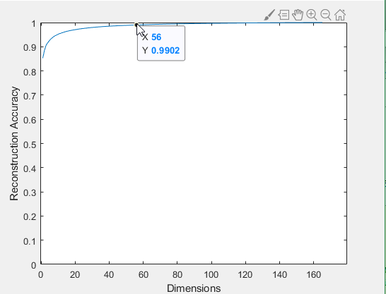
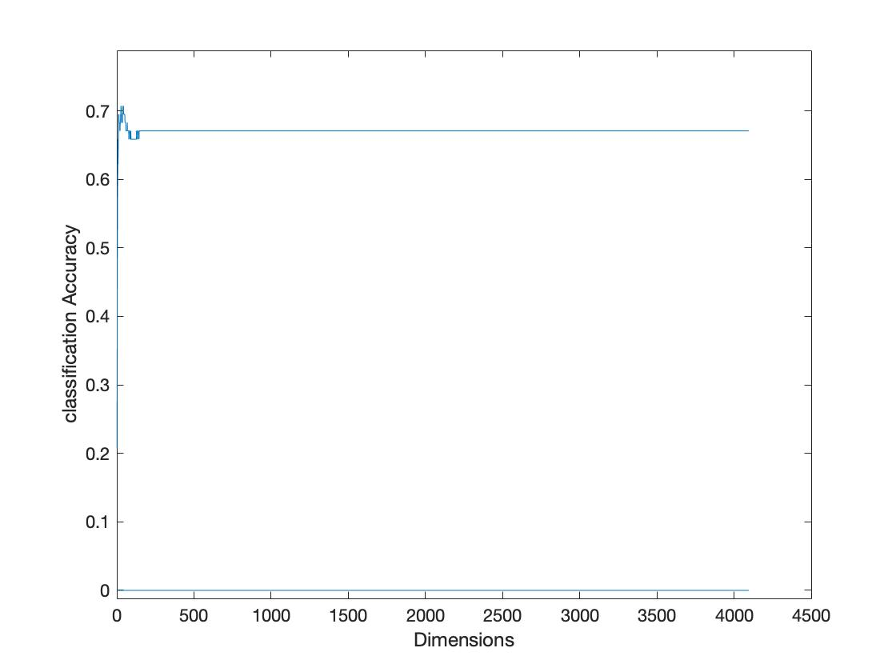
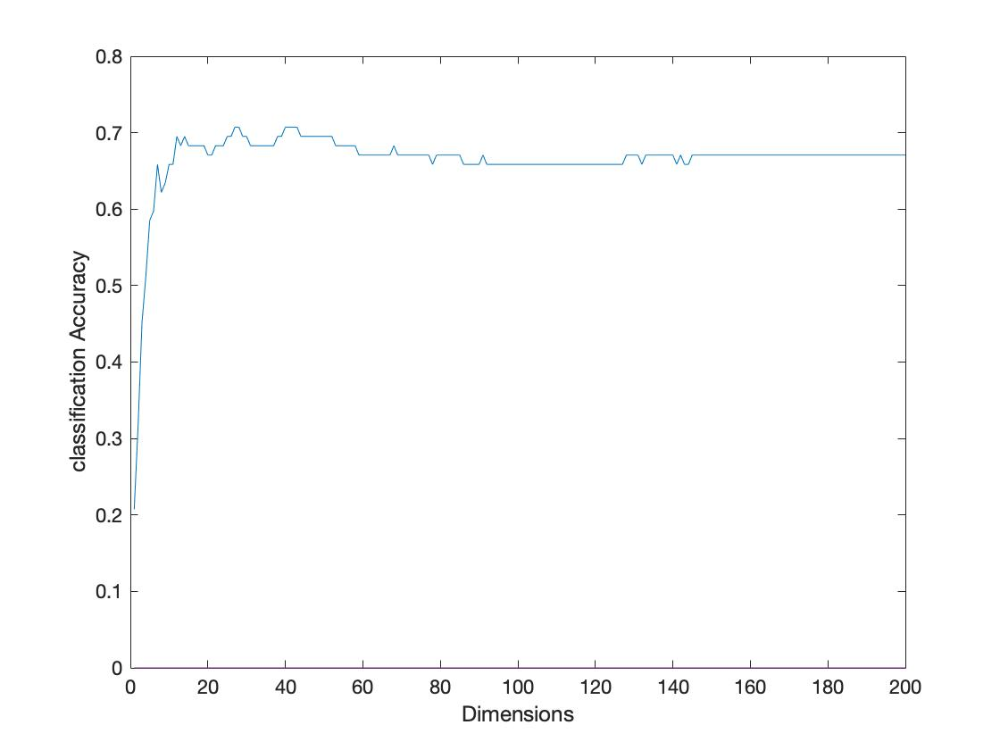

# Assignment 4

## 1

Subset Size | Attributes Selected         | Accuracy  | Attribs Removed
----------- | --------------------------- | --------- | -------------------
5           | All: W, P, Hol, Vac, Health | 85.9%     | None
4           | W, P, Hol, Health           | 89.4737 % | Vac
3           | W, P, Hol                   | 91.2281 % | Vac, Health
2           | W, P                        | 85.9649 % | Vac, Health, Hol
1           | P                           | 80.7018 % | Vac, Health, Hol, W

## 2

There are 3 attributes are selected,

### Selected attributes:

1. wage-increase-first-year
2. pension
3. statutory-holidays

The selected attributes match the attributes founded in Q3 when Subset size is 3.

## 3

Pick attributes

- petallength
- petalwidth Discarded attributes
- sepallength
- sepalwidth
- Copy of sepallength
- Copy of sepalwidth
- Copy of Copy of sepallength
- Copy of Copy of sepalwidth
- Copy of Copy of Copy of sepallength
- Copy of Copy of Copy of sepalwidth

## 4

When PCs/database dimension is 56, the reconstruction accuracy achieve 99.02% reconstruction accuracy.

# 

The number is not match the value from Q2.6\. In Q2.6 the PCs/database dimension value found is 58\. And when the PCs/database dimension number between 54 to 57 , the reconstruction error is 0.010.In Q2.6, it is hard to infer which number the accuracy reconstruction error will under 0.010 around 54 to 58 because of rounding. However, in the graph shows that the reconstruction accuracy achieve will achieve 99.02% when PCs/database dimension value is 56.

## 5

Modify the Cell 5 to generated a graph from 1 dimension to 4096 dimensions:

```matlab
%% Cell 5.
% Find out how classification accuracy varies with PCA dimensions.
array = zeros(4096);
for i = 1: 4096
    nPCA = i;
    pcaFaces  = U(:,1:nPCA)'*(faces-meanFace*ones(1,N));    %PCA Encoding.
    xTr = pcaFaces(:,1:2:end); yTr = gnd(1:2:end);
    xTe = pcaFaces(:,2:2:end); yTe = gnd(2:2:end);
    % class = knnclassify(xTe', xTr', yTr);

    model = fitcknn(xTr', yTr);
    class = predict(model, xTe');


    % fprintf(1,'Dimensions: %d. Accuracy: %1.2f\n', nPCA, sum(class==yTe)/numel(yTe));
    array(i) = sum(class==yTe)/numel(yTe);

end

plot(array);
xlabel('Dimensions');
ylabel('classification Accuracy');
```

The Dimensions from 1 to 4096:

# 

The Dimensions from 1 to 200:

# 

In the graph shows that after 145 dimensions the classification accuracy will stay in 67%. The highest accuracy is 71%, when the nPCA is 27\. it better than raw images(accuracy is 67%, when nPCA is 4096).
